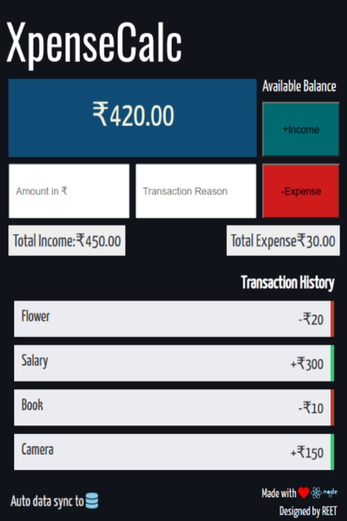

# XpenseCalc

**Track Your Expenses Online**  
XpenseCalc is a web application built using React, Node.js, Express, and MongoDB that helps you manage your income and expenses efficiently.

## Features

- **Add Income**: Record your income with a transaction reason.
- **Add Expense**: Log your expenses along with the purpose.
- **Track Balance**: Real-time display of your available balance.
- **Transaction History**: View a detailed list of your transactions.
- **Data Sync**: Automatic synchronization with the database.
- **User-Friendly UI**: Clean and intuitive design for seamless tracking.

## Tech Stack

- **Frontend**: React.js
- **Backend**: Node.js and Express.js
- **Database**: MongoDB
- **Styling**: CSS (with modern design principles)

## Getting Started

### Prerequisites

Make sure you have the following installed:

- **Node.js** (v14 or above)
- **MongoDB** (ensure MongoDB is running locally or provide a connection URI)

### Installation

1.  Clone this repository:

    ```bash
    git clone https://github.com/your-username/xpensecalc.git
    cd xpensecalc
    ```

2.  Navigate to the project:

    ```bash
    cd xpense-calc
    ```

3.  Set up the .env file:
    Create a .env file in the root directory and add the following:

    ```bash
    NODE_ENV=development
    MONGO_URI=mongodb+srv://<username>:<password>@cluster.mongodb.net/xpensecalc
    PORT=5000
    ```
